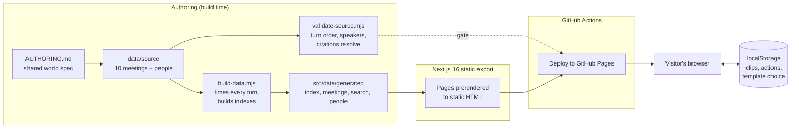
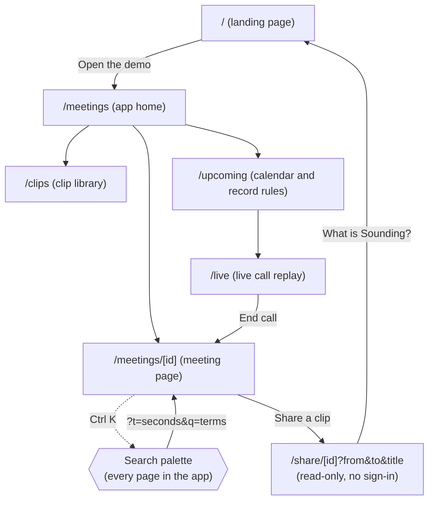
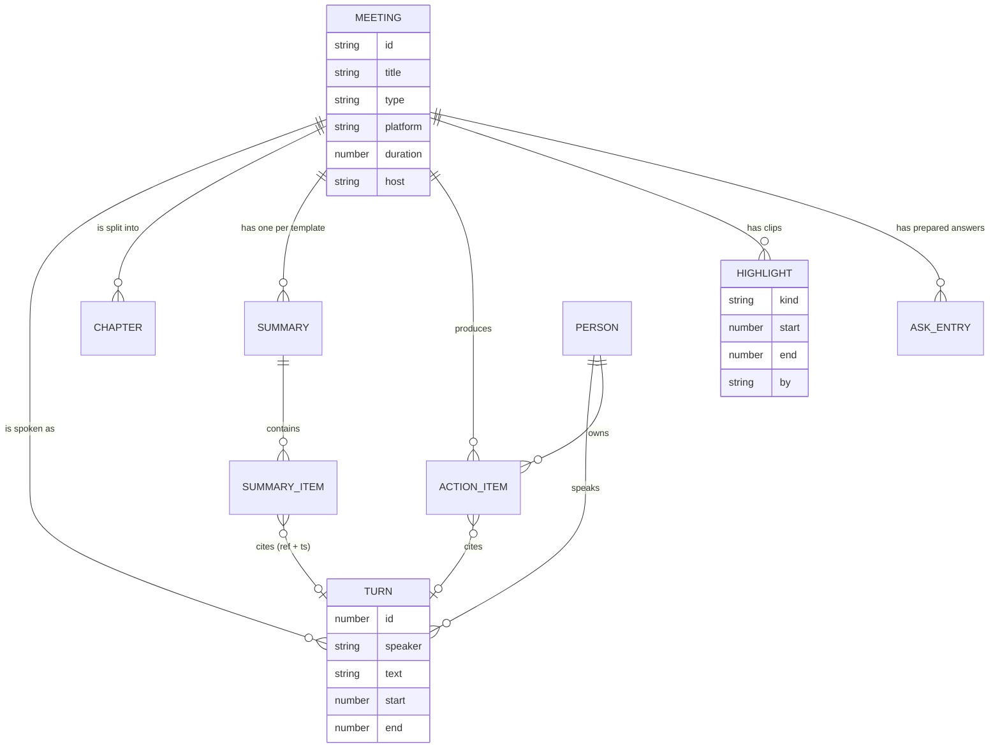
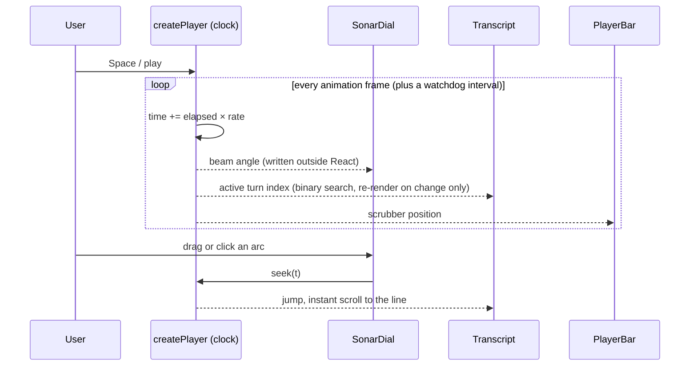
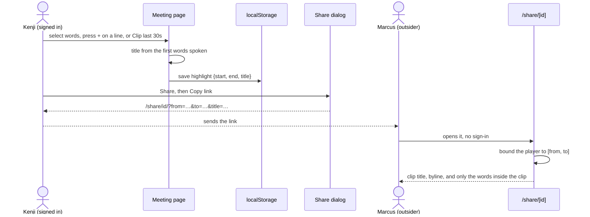
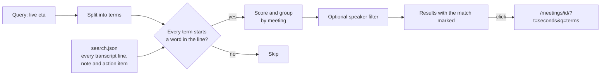
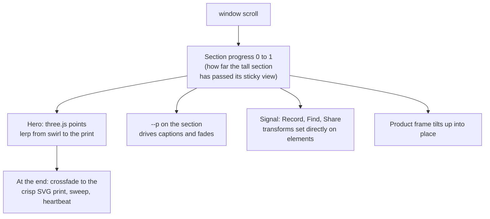
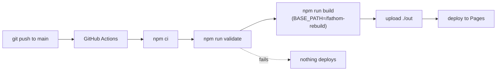
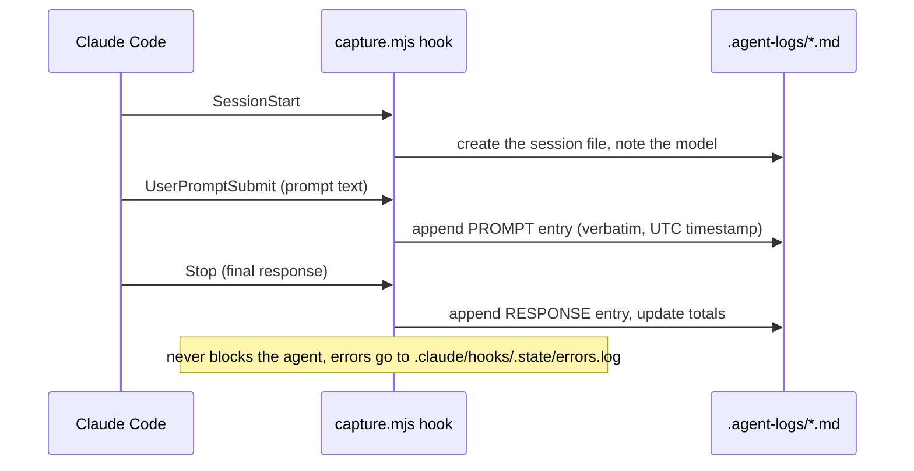

# Architecture: Sounding

How the pieces fit together. Every diagram is drawn by GitHub from the text in this file (Mermaid), so it stays editable.

Related: [BRD](BRD.md) · [PRD](PRD.md) · [Stats](STATS.md)

## 1. The whole system

There is no server. Meetings are authored as text, compiled into JSON at build time, baked into static HTML, and served from GitHub Pages. Anything a viewer creates (clips, checked-off actions, template choices) stays in their own browser.

## 2. Pages

The 10 meeting pages and 10 share pages are generated at build time from `generateStaticParams`. Query parameters (`?t`, `?q`, `?tab`, `?from`, `?to`) are read on the client, inside a Suspense boundary whose fallback renders the full page, so the static HTML is never empty.

## 3. Data model

`build-data.mjs` also writes a slim index for list pages. For each meeting it holds talk time per person, `segments` (speaker, start, end per turn) and `chapterStarts`, which is everything a sonar print needs without loading the full transcript.

## 4. Playback without a recording

The capture layer is stubbed, so playback is a clock. It's a tiny external store, and each component subscribes to just the slice it needs, so a 60 fps clock never re-renders the whole transcript.

The watchdog interval keeps the clock moving in environments that throttle animation frames, and the store is safe under React StrictMode's double mount.

## 5. Clip and share

## 6. Search

Matching at word starts is deliberate: "eta" finds "ETAs", but "live" doesn't match "delivery".

## 7. The landing page's scroll scenes

Progress is read straight from scroll events instead of a timeline library. The picture is always exactly where the reader's thumb is, and it still works where animation frames are throttled. The 3D scene loads lazily, renders only while on screen, and shows the finished print for people who prefer reduced motion.

## 8. Build and deploy

## 9. Agent capture

## 10. Key decisions

| Decision | Why | Trade-off |
|---|---|---|
| Stub the capture layer | The brief allows it; the value is in what happens after the call | No real recording. Said openly everywhere |
| Generate AI notes at seed time | A public static site can't hold an API key | Free-form Ask falls back to retrieval, not generation |
| Static export on GitHub Pages | Free, fast, opens for anyone | No backend; per-viewer state lives in localStorage |
| Time turns from word counts and per-speaker speaking rates | Realistic pacing without audio | Timing is plausible, not measured |
| One shared fictional company across all 10 meetings | Threads recur (the live-ETA promise, the outage, a $310k deal), so search across meetings means something | More authoring work up front |
| A validator in CI | Five agents wrote meetings in parallel; nothing ships with a broken citation | Stricter authoring |
| The sonar print as the product's signature | Shows the shape of a long, crowded call at a glance | A new visual to learn, explained in the UI |
| Word-start search | Precision over recall ("live" shouldn't match "delivery") | Mid-word matches aren't found |
| Scroll progress read directly, not a scroll library | Exact, robust, no extra dependency | Hand-written choreography |
