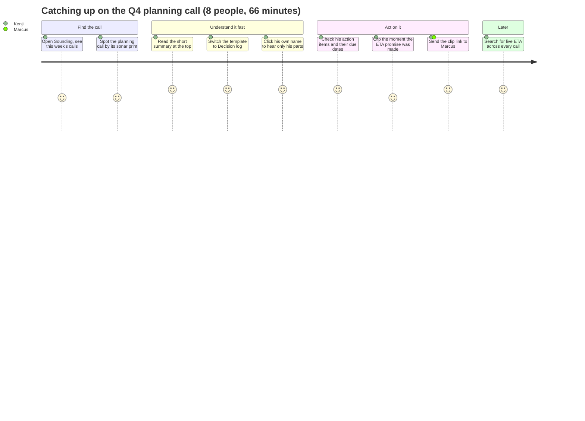

# Product requirements (PRD): Sounding

| | |
|---|---|
| Owner | Asher Ahmed |
| Status | v1 shipped, 2026-10-04 |
| Live | https://ashboi-cyber.github.io/fathom-rebuild/ |
| Related | [BRD](BRD.md) · [Architecture](ARCHITECTURE.md) · [Stats](STATS.md) · [Fathom product map](../research/fathom-product-map.md) · [First-hand findings](../research/my-fathom/FINDINGS.md) |

> Written after the build, from the brief, the research and the code. Status columns describe what is live now.

## 1. Summary

Sounding records meetings and makes them easy to use afterwards. It's built around the day after an hour-long, eight-person call, when someone needs to know what was decided, who promised what, and the exact moment it was said.

## 2. Goals and non-goals

**Goals**
1. Make an 8-person, one-hour call readable at a glance, before pressing play.
2. Every AI claim (summary point, action item, answer) links to the second it came from.
3. Find any word ever said, across every meeting, and land on it.
4. Share one moment with an outsider, and only that moment.

**Non-goals for v1**
- A real recording bot or speech-to-text. Capture is stubbed.
- Live AI calls. Notes are generated at seed time.
- Accounts, teams, billing, CRM and chat integrations, transcript editing.

## 3. Users

| Persona | Situation | What they need |
|---|---|---|
| **Maya, the host** (engineering manager) | Runs the Q4 planning call with seven others | To stay in the conversation, not type notes; to find owners and dates afterwards |
| **Kenji, who missed it** (data scientist) | Was out for half the call | To catch up in minutes, jump to his topic, and hear exactly what was said about his work |
| **Marcus, the outsider** (customer) | Gets a link from the sales rep | To watch one moment without signing up, and see nothing else |

## 4. The key scenario: the day after the 8-person call

## 5. Features

Status key: **Live** means built and working on the public site. **Stubbed** means it's simulated, as the brief allows.

### F1. The meeting page
The core of the product. Most of the build time went here.

| Story | Acceptance criteria | Status |
|---|---|---|
| As a reader, I see the shape of the whole call before pressing play | A sonar dial shows one ring per person (loudest outermost) and one arc per time they spoke, clockwise from twelve | Live |
| As a reader, I can play the call and follow along | Space plays and pauses; the sweep, lit arc and centre caption track the clock; the transcript follows the playhead with "Back to now" | Live, playback **stubbed** as a clock |
| As a reader, I can jump anywhere | Drag the dial or the scrubber; click an arc, a chapter, a timestamp or a transcript line | Live |
| As someone with 8 voices to untangle, I can hear one person | Clicking a name filters the transcript to that speaker; speaker lanes show when each person talked | Live |
| As a reader, I can skim by chapter | Chapters carry one-line summaries, and the current chapter is highlighted while playing | Live |
| As a reader, I can open a link at an exact moment | `?t=` seeks before the first paint; `?q=` highlights the search hit | Live |

### F2. AI notes and templates

| Story | Acceptance criteria | Status |
|---|---|---|
| As a reader, I get the short version first | A one-paragraph summary leads the notes | Live |
| As a reader, I choose the format that fits the meeting | 11 templates (General, Decision log, Project update, MEDDPICC, BANT, Demo, Customer success, One-on-one, Stand-up, Candidate interview, Retrospective); the best fit for the meeting type is marked | Live, generated at seed time |
| As a sceptical reader, I can check any note | Every bullet has a timestamp chip that jumps to the source line; the validator fails the build if a citation points nowhere | Live |

### F3. Action items

| Story | Acceptance criteria | Status |
|---|---|---|
| As an owner, I see what I agreed to | Each item has an owner, an optional due date and a link to the moment | Live |
| As a manager, I see one person's list | Filter by person; check items off; add an item at the playhead; copy open items as a checklist | Live, saved in localStorage |

### F4. Ask

| Story | Acceptance criteria | Status |
|---|---|---|
| As a reader, I can ask a question about the call | Prepared answers carry clickable citations; other questions fall back to quoting the most relevant transcript lines with timestamps | Live, no live model call |

### F5. Clips and sharing

| Story | Acceptance criteria | Status |
|---|---|---|
| As a reader, I clip a moment in one action | Three ways: select words, press **+** on a line, or **Clip last 30s** during playback; titled automatically from the first line spoken | Live |
| As a sharer, I send it to someone outside | The share dialog has three access levels and a copyable link | Live, invites marked as simulated |
| As the outsider, I see the moment and nothing else | The share page opens without sign-in, leads with the clip title, and shows only the words in the clip, with no notes or action items | Live |
| As a team, we find clips again | A clips library filters by "Everyone's" / "Saved by me" and by type | Live |

### F6. Search across meetings

| Story | Acceptance criteria | Status |
|---|---|---|
| As anyone, I find a word wherever it was said | Ctrl K or / opens search across every transcript line, note and action item; terms match at word starts ("live" doesn't match "delivery") | Live |
| As anyone, I narrow by speaker | Speaker chips filter the results | Live |
| As anyone, I land on the moment | A result opens the meeting at that second with the hit highlighted | Live |

### F7. Highlight during a live call

| Story | Acceptance criteria | Status |
|---|---|---|
| As an attendee, I mark a moment without breaking flow | H, A or X captures a highlight, action item or concern; the capture reaches back to when the current speaker started | Live, the call is a **replay** |
| As an attendee, I find my marks afterwards | Ending the call "processes" it and files the captures into that meeting's clips | Live, processing **stubbed** |

### F8. Calendar and recording rules

| Story | Acceptance criteria | Status |
|---|---|---|
| As a host, I control what gets recorded | Rule: all, external, ones I organise, or none; override any single meeting | Live, calendar **stubbed** |
| As a host, I see what's next | The app home shows the next meeting | Live |

### F9. Landing page

| Story | Acceptance criteria | Status |
|---|---|---|
| As a visitor, I understand the product in one scroll | The hero assembles a real call's sonar print as you scroll; a pinned section shows Record, Find, Share on the real transcript; counters come from the seeded data | Live |
| As a visitor, I try it without signing up | "Open the demo" goes straight into the workspace; the real meeting page runs inside a browser frame | Live |
| As a visitor, I know what's real | The FAQ says what is simulated; pricing is labelled as demo pricing | Live |

### F10. App home

| Story | Acceptance criteria | Status |
|---|---|---|
| As a user, I see my recent calls | Newest first, grouped by day, each with its sonar print, a one-line summary, duration and head count; filters for with customers, internal and hosted by me | Live |

## 6. Non-functional requirements

| Area | Requirement | How it's met |
|---|---|---|
| Access | Opens for anyone, with no sign-in | Static export on GitHub Pages |
| Performance | Fast first paint; heavy visuals never block | Static HTML for every page; three.js lazy-loaded and paused offscreen; the playback clock re-renders only what changed |
| Accessibility | Keyboard and screen-reader usable | Focus traps in dialogs, Escape closes menus, labelled controls, 24px minimum targets, text contrast lifted to WCAG AA, reduced-motion respected |
| Responsive | Works at phone width | Every page checked at 375px with no horizontal scroll |
| Privacy | A shared clip exposes only that clip | Share pages render only the bounded transcript |
| Data integrity | Notes never cite a moment that doesn't exist | `npm run validate` in CI blocks the deploy |
| Honesty | Simulated parts are labelled | README, FAQ, share dialog and walkthrough |

## 7. Metrics we would track in production

These aren't measured in the demo; they're how v2 would be judged.

| Metric | Why |
|---|---|
| Time to first answer after a call (open, then the moment found) | The core promise: minutes, not an hour |
| Search success rate (a search that ends in a click) | Fathom's first-hand miss was search |
| Citation clicks per summary | Whether people check the AI, and whether it holds up |
| Clips shared per meeting, and outsider opens | Proof the meeting reached people who weren't on it |
| Edits to action-item owners | A proxy for transcription and attribution errors |

## 8. What comes next

| Item | Notes |
|---|---|
| Real capture | A meeting bot, or desktop audio capture, plus speech-to-text with speaker diarisation |
| Live AI | Notes, Ask and templates from a model at request time, behind a server |
| Accounts and teams | Sign-in, shared libraries, permissions on share links |
| Keyboard shortcuts | J / K / L to skip and change speed |
| Clip editing | Trim and rename after creating |
| Search semantics | Full combobox and listbox roles for screen readers |
| Transcript correction | Fix a misheard word once and update every note that quotes it (the "ATX" problem) |
