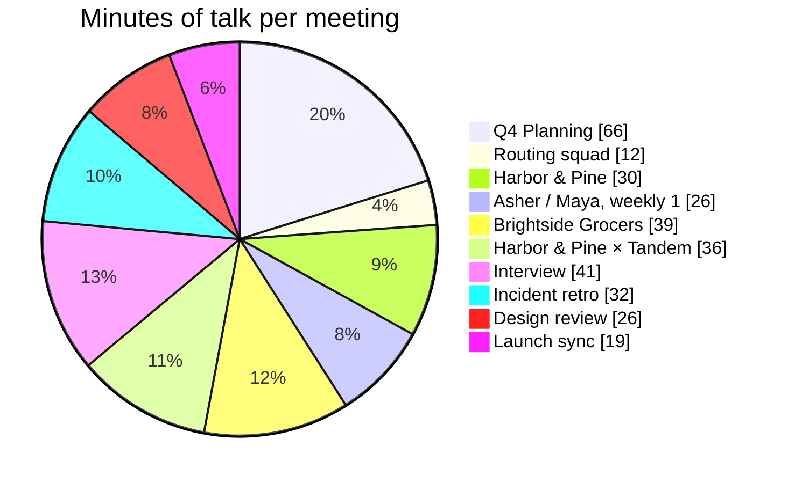
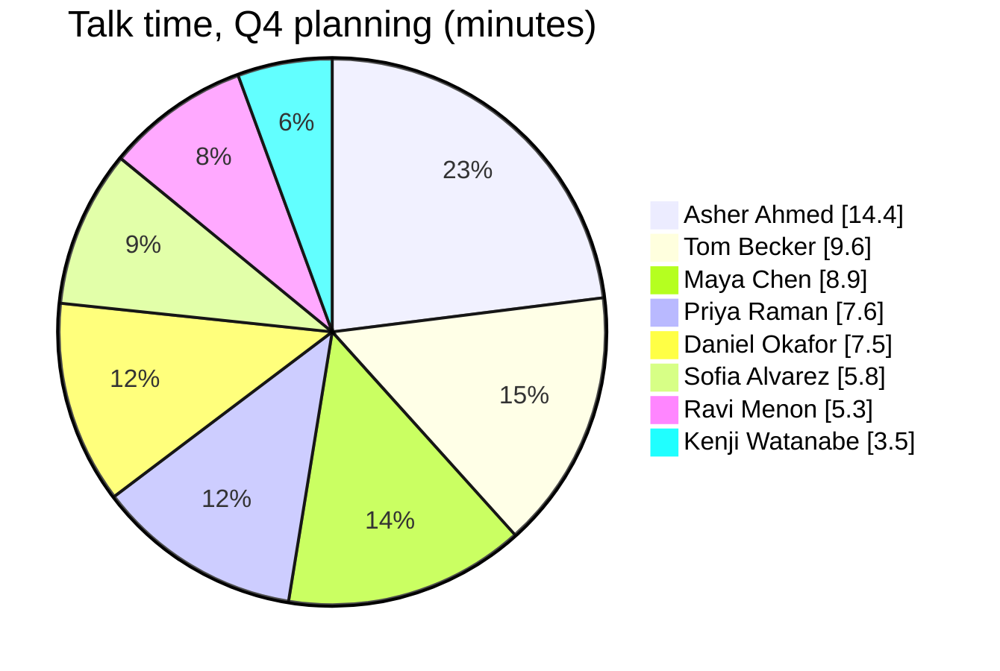
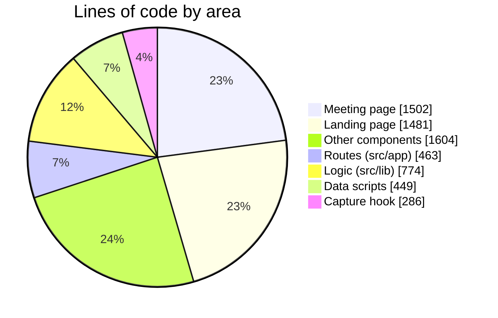
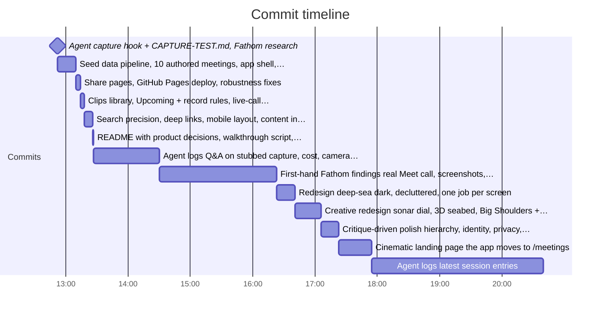

# Project stats

Generated by `npm run stats` ([scripts/doc-stats.mjs](../scripts/doc-stats.mjs)) from the repository itself. Last run: 2026-10-04 15:47 UTC.

## At a glance

| | |
|---|---|
| Seeded meetings | 10 (4 with customers, 6 internal) |
| People in the seeded company and its customers | 15 |
| Talk time | 5h 27m |
| Words of transcript | 46,433 |
| Turns (a stretch of one person speaking) | 1,335 |
| Action items | 84 |
| Seeded clips | 38 |
| Chapters | 49 |
| Note summaries (meeting × template) | 26 |
| Prepared Ask answers | 57 |
| Pages (routes) | 7 route files, 28 HTML pages in the static build |
| React components | 36 |
| Hand-written code | 6,559 lines in 66 files |
| Authored source data | 32 files, 476 KB |
| Runtime dependencies | 7 (@gsap/react, @phosphor-icons/react, gsap, next, react, react-dom, three) |
| Commits | 13 |
| Agent log sessions | 3, with 41 prompts logged |
| Static build size | 10.9 MB |

## The meetings

| Meeting | Type | People | Length | Turns | Words | Action items | Chapters |
|---|---|---:|---:|---:|---:|---:|---:|
| [Q4 Planning: Routing v3 & Driver App](https://ashboi-cyber.github.io/fathom-rebuild/meetings/q4-planning/) | Planning | 8 | 66:13 | 298 | 9,308 | 11 | 8 |
| [Routing squad: daily stand-up](https://ashboi-cyber.github.io/fathom-rebuild/meetings/routing-standup/) | Stand-up | 5 | 12:25 | 65 | 1,723 | 7 | 3 |
| [Harbor & Pine: Routing v3 demo & pilot terms](https://ashboi-cyber.github.io/fathom-rebuild/meetings/harbor-pine-demo/) | Demo | 4 | 29:58 | 121 | 4,143 | 8 | 4 |
| [Asher / Maya, weekly 1:1](https://ashboi-cyber.github.io/fathom-rebuild/meetings/asher-maya-1on1/) | 1:1 | 2 | 25:54 | 88 | 3,802 | 8 | 5 |
| [Brightside Grocers: Q3 Business Review](https://ashboi-cyber.github.io/fathom-rebuild/meetings/brightside-qbr/) | Customer | 4 | 38:51 | 134 | 5,471 | 10 | 5 |
| [Harbor & Pine × Tandem: Discovery call](https://ashboi-cyber.github.io/fathom-rebuild/meetings/harbor-pine-discovery/) | Sales | 4 | 36:07 | 159 | 4,997 | 8 | 5 |
| [Interview: Sam Rivera, Senior Frontend Engineer](https://ashboi-cyber.github.io/fathom-rebuild/meetings/interview-sam-rivera/) | Interview | 3 | 40:57 | 143 | 6,260 | 6 | 6 |
| [Incident retro: ETA service outage (Sep 24)](https://ashboi-cyber.github.io/fathom-rebuild/meetings/incident-retro/) | Retro | 6 | 31:35 | 116 | 4,610 | 10 | 5 |
| [Design review: Driver app onboarding](https://ashboi-cyber.github.io/fathom-rebuild/meetings/onboarding-design-review/) | Design review | 4 | 25:54 | 120 | 3,506 | 8 | 4 |
| [Launch sync: Routing v3 announcement](https://ashboi-cyber.github.io/fathom-rebuild/meetings/launch-sync/) | Sync | 3 | 18:45 | 91 | 2,613 | 8 | 4 |

### Minutes of talk per meeting

### Who talked in the 8-person call (Q4 Planning Routing v3 & Driver App)

The case the brief singles out. Share of talk time, in minutes:

## The code

| Area | Folder | Files | Lines |
|---|---|---:|---:|
| Meeting page | `src/components/meeting` | 10 | 1,502 |
| Landing page | `src/components/landing` | 12 | 1,481 |
| Other components | `src/components` | 16 | 1,604 |
| Routes (src/app) | `src/app` | 10 | 463 |
| Logic (src/lib) | `src/lib` | 14 | 774 |
| Data scripts | `scripts` | 3 | 449 |
| Capture hook | `.claude/hooks` | 1 | 286 |
| **Total** | | **66** | **6,559** |

## How the build went

Every commit, in order (local time). The gaps between them are the work.

| When | Commit |
|---|---|
| 2026-10-04 12:52 | Agent capture hook + CAPTURE-TEST.md, Fathom research |
| 2026-10-04 13:10 | Seed data pipeline, 10 authored meetings, app shell, meeting page |
| 2026-10-04 13:14 | Share pages, GitHub Pages deploy, robustness fixes |
| 2026-10-04 13:18 | Clips library, Upcoming + record rules, live-call simulation |
| 2026-10-04 13:26 | Search precision, deep links, mobile layout, content in static HTML |
| 2026-10-04 13:27 | README with product decisions, walkthrough script, favicon |
| 2026-10-04 14:30 | Agent logs: Q&A on stubbed capture, cost, camera requirement |
| 2026-10-04 16:23 | First-hand Fathom findings: real Meet call, screenshots, comparison |
| 2026-10-04 16:41 | Redesign: deep-sea dark, decluttered, one job per screen |
| 2026-10-04 17:06 | Creative redesign: sonar dial, 3D seabed, Big Shoulders + Familjen |
| 2026-10-04 17:23 | Critique-driven polish: hierarchy, identity, privacy, accessibility |
| 2026-10-04 17:55 | Cinematic landing page; the app moves to /meetings |
| 2026-10-04 20:40 | Agent logs: latest session entries |

## Agent logs

Captured automatically by the hook in `.claude/hooks/capture.mjs` (see [CAPTURE-TEST.md](../CAPTURE-TEST.md)). Never edited by hand.

| Log file | Prompts | Responses | Size |
|---|---:|---:|---:|
| [2026-10-04_07-26-48_de0c3edc-4933-4d75-bbc0-862560f5b308.md](../.agent-logs/2026-10-04_07-26-48_de0c3edc-4933-4d75-bbc0-862560f5b308.md) | 39 | 29 | 107 KB |
| [2026-10-04_07-39-26_8c059515-4e66-4aab-a047-0192fb63fe35.md](../.agent-logs/2026-10-04_07-39-26_8c059515-4e66-4aab-a047-0192fb63fe35.md) | 1 | 0 | 1 KB |
| [2026-10-04_07-49-11_82ce463f-33c1-41f2-81cb-1f83d6ab1cc8.md](../.agent-logs/2026-10-04_07-49-11_82ce463f-33c1-41f2-81cb-1f83d6ab1cc8.md) | 1 | 1 | 2 KB |

Project skills installed in `.claude/skills`: `design-taste-frontend`, `frontend-design`, `high-end-visual-design`, `impeccable`, `redesign-existing-projects`, `review-animations`, `shadcn`, `supabase`, `vercel-react-best-practices`, `web-design-guidelines`. GSAP's official skills were installed at user level.
